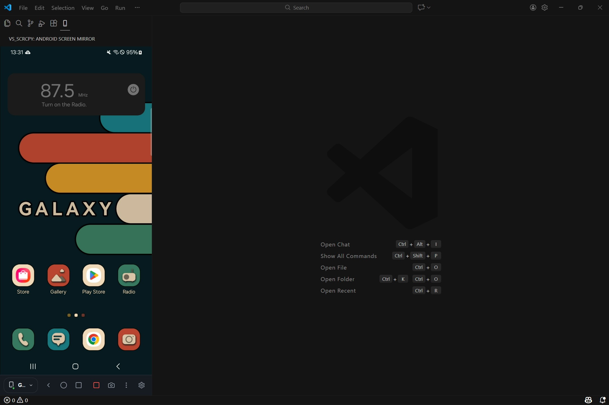
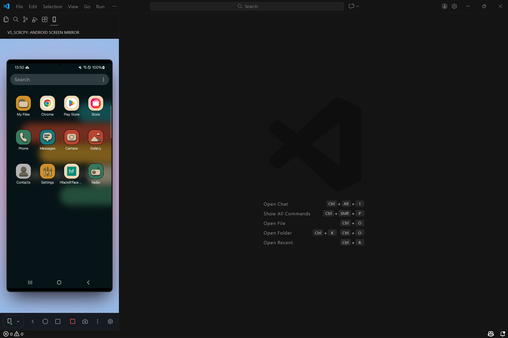
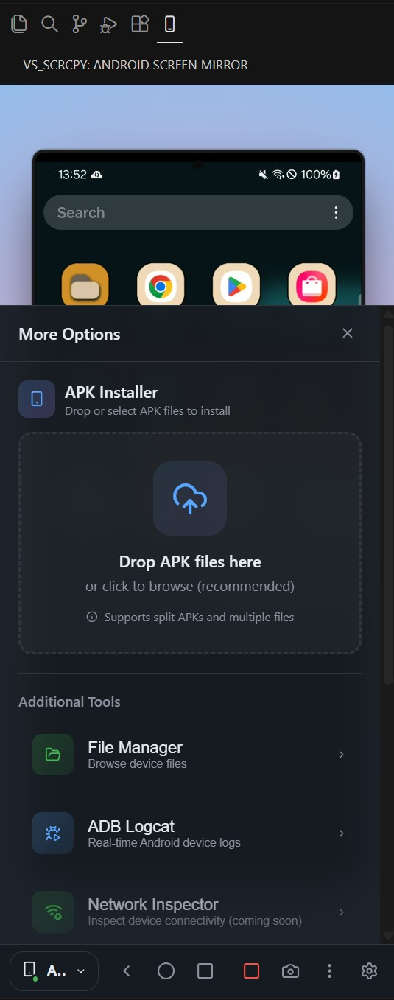
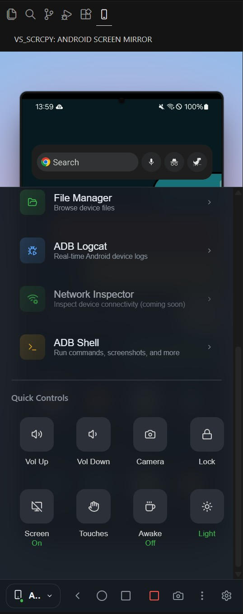
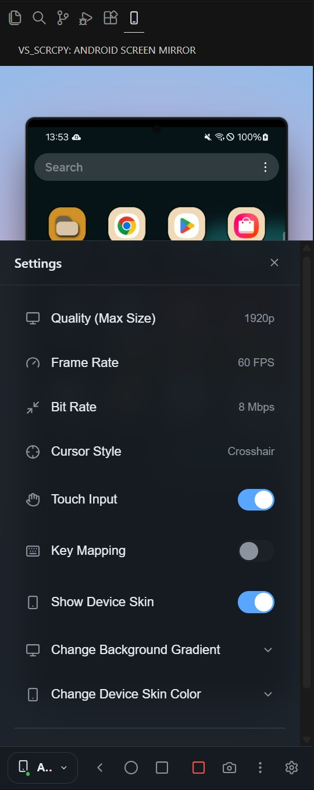
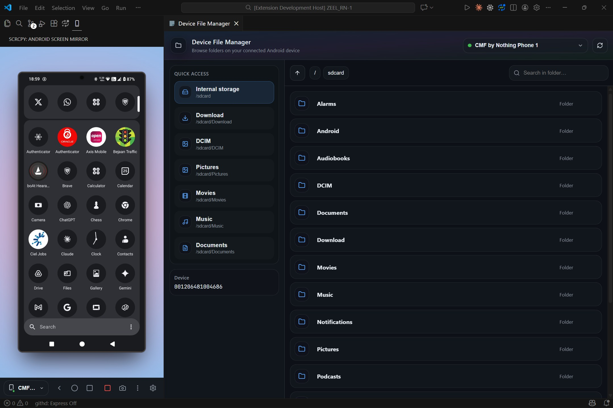
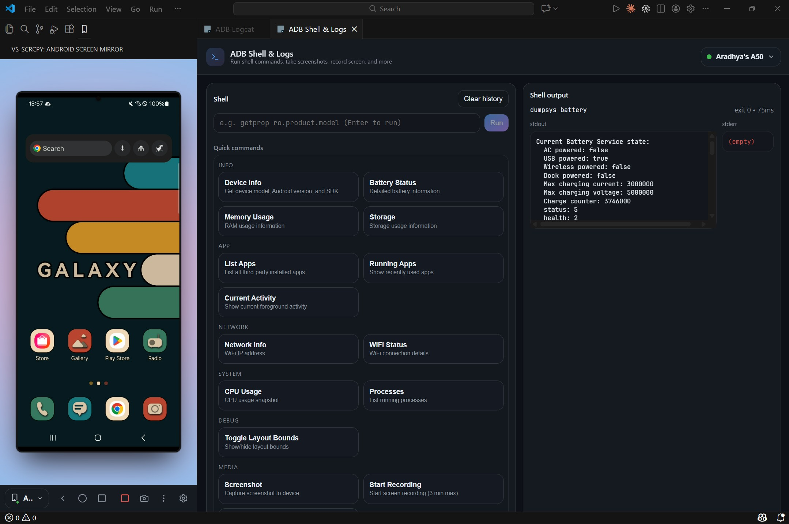
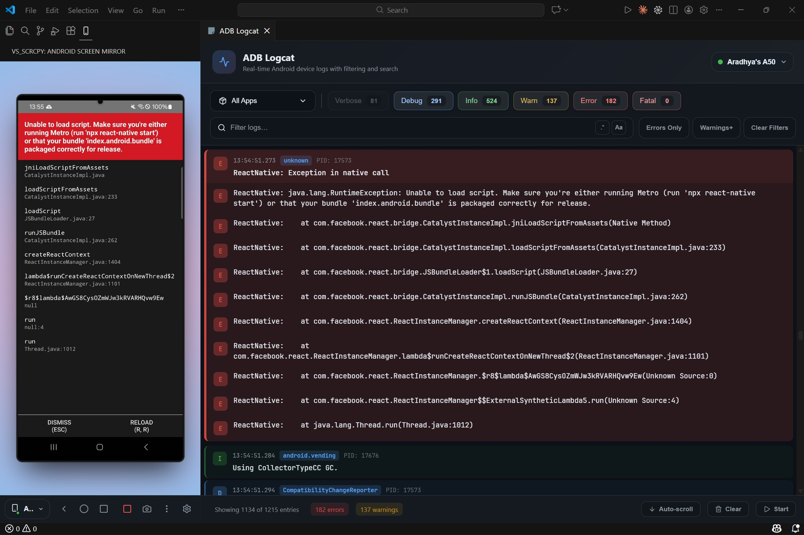

# VS Code Scrcpy

Mirror your Android device screen directly in VS Code — with full touch control, file management, and ADB tools built-in.



---

## Screenshots

<p align="center">
  
  <br />
  <b>Screen Mirroring</b>
  <br />
  <sub>Real-time device display with touch controls</sub>
</p>

<p align="center">
  
  <br />
  <b>APK Installer,ADB logcat and Shell</b>
  <br />
  <sub>Drag and drop APKs,view ADB logs.</sub>
</p>

<p align="center">
  
  <br />
  <b>Device Controls</b>
  <br />
  <sub>Navigation, volume, and quick actions</sub>
</p>

<p align="center">
  
  <br />
  <b>Settings</b>
  <br />
  <sub>Configure quality, FPS, and bitrate</sub>
</p>

<p align="center">
  
  <br />
  <b>File Manager</b>
  <br />
  <sub>Browse and manage device files</sub>
</p>

<p align="center">
  
  <br />
  <b>ADB Shell & Commands</b>
  <br />
  <sub>Run commands with quick access presets</sub>
</p>

<p align="center">
  
  <br />
  <b>Logcat Viewer</b>
  <br />
  <sub>Filter logs by package and level</sub>
</p>

---

## Features

### Real-Time Screen Mirroring
Mirror your Android device screen directly in VS Code's sidebar or as a floating panel. Watch your app render in real-time while you code.

- H.264 video streaming
- Up to 60 FPS with configurable resolution
- Touch input support — interact with your device using your mouse
- Hardware-accelerated WebGL rendering

### Device Control Panel
- **Navigation buttons** — Home, Back, App Switcher
- **Volume controls** — Up and Down
- **Screen controls** — Lock screen, toggle power
- **Quick actions** — Launch camera, take screenshots
- **Developer options** — Toggle show touches, layout bounds

### File Manager
Browse and manage your device's filesystem:

- Navigate directories with an intuitive UI
- Pull files from device to your computer
- Delete files and folders
- Open files with your default system app

### ADB Shell & Logs
Execute shell commands and monitor logs:

- **Interactive shell** — Run any ADB command
- **Command history** — Persisted across sessions
- **quick commands** — One-click access to common operations

### Logcat Viewer
Monitor your ADB logs:

- **Package filtering** — Focus on your app's logs
- **Log level filtering** — Verbose, Debug, Info, Warning, Error, Fatal
- **Crash detection** — Automatic stack trace grouping and highlighting
- **Multiple buffers** — Main, System, Crash, Events

### App Management
Manage installed applications:

- View all installed 3rd party packages
- Access recent apps quickly

### APK Installation
Install apps with ease:

- Drag-and-drop APK installation
- Support for split APKs
- Installation progress tracking

### Device Information
Monitor your device status:

- Battery level and charging status
- Network connectivity and signal strength
- Storage usage
- Device model and Android version

---

## Quick Commands

Access built-in shell commands with one click:

| Category | Commands |
|----------|----------|
| **Device Info** | Get model, Android version, SDK version |
| **Apps** | List packages, get app paths, clear app data |
| **Activities** | Start activities, force stop apps, send broadcasts |
| **System** | Battery info, memory info, window info |
| **Settings** | Get/put system, secure, and global settings |
| **Input** | Simulate taps, swipes, text input, key events |
| **Media** | Screenshot, screen recording |
| **Developer** | Layout bounds, show touches, GPU rendering |
| **Network** | Network status, IP address, interface config |

---

## Requirements

- **VS Code** 1.85.0 or higher
- **ADB** (Android Debug Bridge) in your PATH
- **Android device** with USB debugging enabled and necessary permissions.

---

## Installation

### From Source

```bash
# Clone the repository
git clone https://github.com/Aradhya1905/vscode-scrcpy.git
cd vscode-scrcpy

# Install all dependencies
npm run install:all

# Compile the extension
npm run compile

# Press F5 in VS Code to launch the extension
```

---

## Usage

1. **Connect your Android device** via USB (or wirelessly via ADB)
2. **Enable USB debugging** on your device (Developer options)
3. **Grant USB debugging permission** on your device when prompted (tap **Allow** / **Always allow from this computer**)
4. **Click the mobile device icon** in the VS Code activity bar
5. **Select your device** from the dropdown
6. **Start mirroring** — your device screen appears in VS Code!

### Commands

Open the Command Palette (`Ctrl+Shift+P` / `Cmd+Shift+P`) and type:

| Command | Description |
|---------|-------------|
| `Scrcpy: Start Screen Mirror` | Begin mirroring your device |
| `Scrcpy: Stop Screen Mirror` | Stop the mirroring session |
| `Scrcpy: Open File Manager` | Browse device filesystem |
| `Scrcpy: Open ADB Shell & Logs` | Access shell and logcat |

---

## Development

```bash
# Install dependencies
npm run install:all

# Compile everything
npm run compile

# Watch for changes (extension)
npm run watch

# Watch for changes (webview UI)
npm run watch:webview

# Lint code
npm run lint

# Format code
npm run format
```

### Project Structure

```
vscode-scrcpy/
├── src/                    # Extension source code
│   ├── extension.ts        # Extension entry point
│   ├── services/           # Core services (ADB, Scrcpy, Device management)
│   └── views/              # Webview panels and views
├── webview-ui/             # React-based UI
│   └── src/
│       ├── apps/           # Main application components
│       ├── components/     # Reusable UI components
│       └── hooks/          # Custom React hooks
└── out/                    # Compiled extension
```

---

## Tech Stack

- **Extension**: TypeScript, VS Code Extension API
- **UI**: React 18, Vite, Lucide Icons
- **ADB Integration**: [@yume-chan/adb](https://github.com/yume-chan/ya-webadb)
- **Scrcpy Protocol**: [@yume-chan/scrcpy](https://github.com/yume-chan/ya-webadb)
- **Video Decoding**: H.264, WebGL Canvas

---

## Acknowledgments

- [Scrcpy](https://github.com/Genymobile/scrcpy) — The incredible tool that makes this possible
- [@yume-chan](https://github.com/yume-chan/ya-webadb) — The TypeScript implementations of ADB and Scrcpy protocols made it possible to bring native Android screen mirroring directly into VS Code.

---

## License

MIT

---

## Contributing

Contributions are welcome! Feel free to:

- Report bugs
- Suggest features
- Submit pull requests

